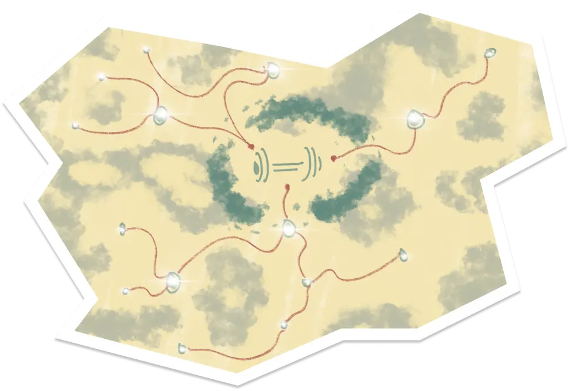

# Gym Buddies

It is one of the [NTU](https://www.ntu.edu.sg/)'s CZ2004 Human Computer Interaction Module Project

## What?

We are tasks to developed an application comprehensive enough to apply simple Software Development Life Cycle (SDLC).

## Why?

To apply software engineer practices and processes we learnt from this module

## How?

1. Idealise and Formulate possible applications for development
2. Draft possible requirements and features
3. Defined problem statement, purpose, scope, people of interest, assumption and constraint, dependencies, references, operating tools and environments, data dictionary
4. Defined functional and non-functional requirements, use-case models and descriptions, class diagrams, dialog, sequence, diagram
5. Design and Defined UI, UI Flow
6. Design and Defined Software Architecture, possible Patterns
7. User Acceptance Test (UAT), White and Black box testing
8. Code implementation, documentation, testing, integration, deployment, release

## Highlights

## Disclaimer

All external data and assets used in this project is intended for educational purpose only.

## Contributor

Under Construction Team
